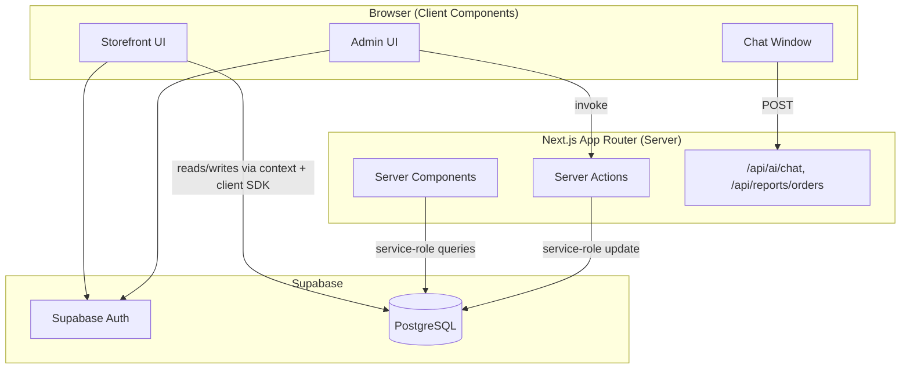
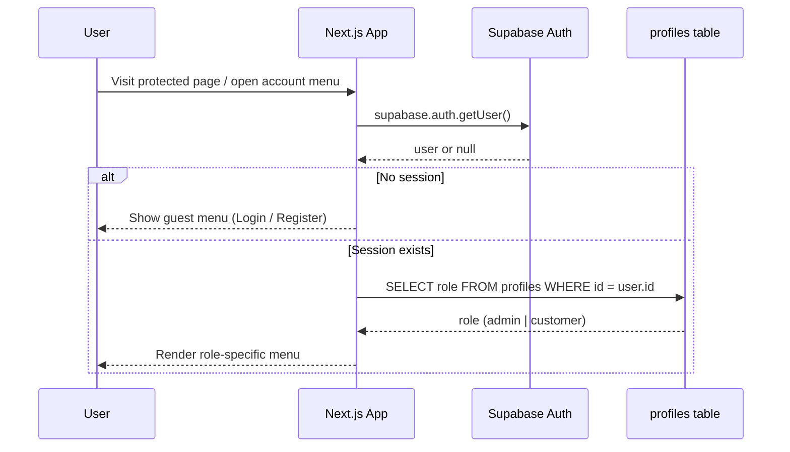
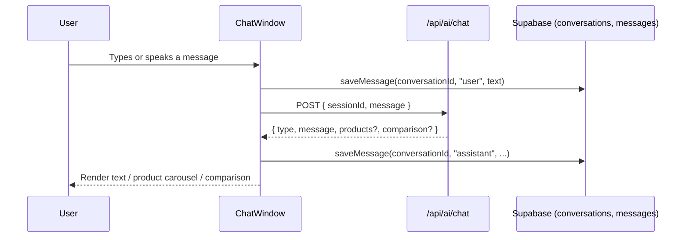
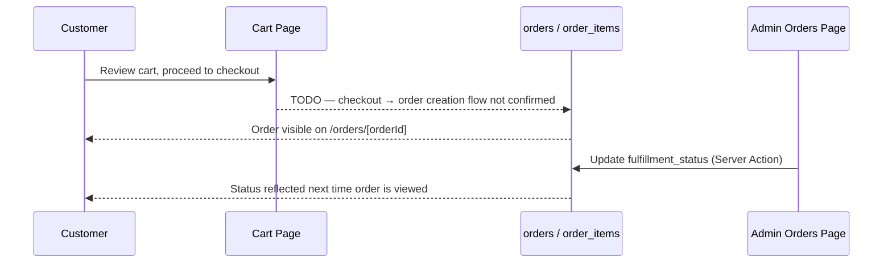
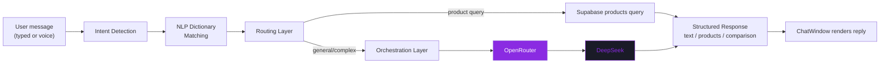
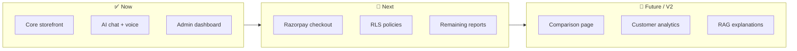

<div align="center">

# 🛒 CartIQ

### AI-Integrated Personalized Shopping Platform

**Conversational shopping. Real-time inventory. A dashboard built for operators, not just admins.**

[](https://nextjs.org/)
[](https://www.typescriptlang.org/)
[](https://supabase.com/)
[](https://www.postgresql.org/)
[](https://tailwindcss.com/)
[](https://openrouter.ai/)
[](#-license)

[](#-contributing)
[]()
[]()
[]()
[](#-feature-completion-snapshot)

<a href="#-about-cartiq">
  
</a>

</div>

> [!NOTE]
> **Honesty first.** Every feature described below is backed by code that actually exists in this repository. Anywhere a claim couldn't be verified against the codebase, you'll see a clearly marked `> TODO` block instead of invented functionality. That rule applies to this whole README, including the sections below — nothing here inflates a number that the code doesn't back up.

---

## 🔑 Legend

Used consistently across every table below — scan for these instead of re-reading prose:

| Symbol | Meaning |
|:---:|---|
| ✅ | Shipped and confirmed against the actual codebase |
| ⚠️ | Partially built — the pieces exist, the flow isn't complete |
| 🚧 | UI/scaffolding exists, wiring is a `TODO` |
| `TODO` | Not confirmed during review — don't present as fact until verified |

---

## 🎬 Demo

<div align="center">

</div>

<br/>

> 🚧 **Live preview is temporarily hidden.** The deployed site is offline from public view right now while the backend is being tested under higher traffic load — it'll be redeployed once that testing wraps up. The demo recording and screenshots below reflect the real, running app in the meantime.

---

## 📚 Table of Contents

- [About CartIQ](#-about-cartiq)
- [Why CartIQ?](#-why-cartiq)
- [What Makes This Different](#-what-makes-this-different)
- [Feature Completion Snapshot](#-feature-completion-snapshot)
- [Features](#-features)
  - [Customer Features](#customer-features)
  - [Admin Features](#admin-features)
  - [AI Features](#ai-features)
  - [Security Features](#security-features)
  - [Performance Notes](#performance-notes)
  - [Developer Features](#developer-features)
- [Screenshots](#-screenshots)
- [Architecture](#-architecture)
- [Design System](#-design-system)
- [Tech Stack](#-tech-stack)
- [Project Evolution](#-project-evolution)
- [Folder Structure](#-folder-structure)
- [Installation Guide](#-installation-guide)
- [Environment Variables](#-environment-variables)
- [Database Design](#-database-design)
- [Server Actions & API Routes](#-server-actions--api-routes)
- [Security](#-security)
- [AI Architecture](#-ai-architecture)
- [Roadmap](#-roadmap)
- [FAQ](#-faq)
- [Deployment](#-deployment)
- [Contributing](#-contributing)
- [License](#-license)
- [Authors](#-authors)
- [Acknowledgements](#-acknowledgements)

---

## 🧭 About CartIQ

**The problem.** Most e-commerce storefronts are search boxes and filter sidebars wearing a fresh coat of paint. The customer still does all the cognitive work — comparing specs across tabs, guessing whether a review is trustworthy, hunting through categories that don't match how they actually think about what they want.

**The solution.** CartIQ puts a conversational AI assistant directly into the shopping flow. Instead of only filtering by category and price, a customer can describe what they need in plain language and get back real product matches sourced live from the store's own Supabase-backed catalog — with the same product data, images, and pricing shown throughout the rest of the site.

**Mission.** Make product discovery feel like asking a knowledgeable friend, not operating a spreadsheet.

**Vision.** A storefront where the AI layer isn't a bolted-on chatbot widget, but shares state with cart, wishlist, and order history — so recommendations, comparisons, and support all draw from the same source of truth.

**Current goals.**
- Solid, working core commerce flows (browse → cart → checkout → order tracking) — ✅ implemented.
- A conversational assistant wired to real inventory — ✅ implemented.
- An admin surface for operators to manage orders, watch inventory, and export reports — ✅ implemented.
- Deeper personalization and analytics — 🚧 see [Roadmap](#-roadmap).

---

## 💡 Why CartIQ?

Traditional storefronts assume the customer already knows the right search terms, category, and filters. That works for a repeat buyer who knows exactly what SKU they want — it works much less well for someone who knows the *problem* they're solving but not the *product name* that solves it.

CartIQ's assistant is built to sit inside that gap: a customer can type something like "white sneakers under ₹3,000" and get an actual query against the live `products` table, not a canned response. As the catalog and AI layer grow, the goal is for that same conversational surface to also explain *why* a product fits, not just that it matched a keyword — see [AI Architecture](#-ai-architecture) for exactly what's built today versus what's still on the roadmap.

---

## 🏆 What Makes This Different

A lot of portfolio e-commerce projects share the same tells: mock JSON standing in for a database, an "admin dashboard" wired to static numbers, and a README that claims features nobody can click through to. CartIQ is built — and documented — to avoid all three:

| Typical template project | CartIQ |
|---|---|
| Mock/static product data | Live Supabase `products` table, same data everywhere |
| Admin stats hardcoded in the UI | Dashboard numbers computed from real Supabase queries |
| Client calls hit the database directly for everything | Privileged writes isolated behind Server Actions + a service-role client the browser never sees |
| README lists "AI-powered" with no detail | [AI Architecture](#-ai-architecture) names the actual provider, pipeline, and what's still unverified |
| Docs quietly go stale as the code moves on | Every completion number is pinned to the tables that produced it — see the note under [Feature Completion Snapshot](#-feature-completion-snapshot) |

---

## 📊 Feature Completion Snapshot

> Counted directly from the status columns in [Features](#-features) below — not a vibe estimate. If a number here ever drifts from the tables below, the tables are the source of truth.

<div align="center">

| Area | Shipped | Outstanding | Completion |
|---|:---:|---|:---:|
| 🛍️ Customer Experience | 11 / 12 features | Full Razorpay checkout integration |  |
| 🛠️ Admin Tools | 7 / 8 features | Sales / Inventory / Customer / Excel reports |  |
| 🤖 AI Assistant Core | 5 / 5 scoped features | RAG scope & multi-session memory — see [AI Architecture](#-ai-architecture) |  |
| 🔐 Security | App-layer auth, scoping & service-role isolation | Database-level RLS policies not yet confirmed |  |

</div>

**Reading this honestly:** the two things standing between CartIQ and "production-ready" are finishing the Razorpay checkout flow end-to-end and confirming/adding real Postgres RLS policies to back up the app-layer role checks. Everything else in the core shopping and admin experience is real, working code today.

---

## ✨ Features

> Every bullet below maps to a real component, route, or table in this repository. Nothing here is aspirational — aspirational items live in [Roadmap](#-roadmap) instead.

### Customer Features

| Feature | Status | Notes |
|---|---|---|
| Product browsing & product detail pages | ✅ | `/products`, `/products/[slug]` |
| Cart | ✅ | Persistent cart via `cart-context`, quantity controls, line-item removal |
| Wishlist | ✅ | `wishlist-context`, wishlist count badge in the nav |
| Global search | ✅ | Debounced (300ms) Supabase search across `title`, `description`, and `tags` |
| Product comparison | ✅ | `ComparisonCard` component renders side-by-side comparisons inside chat responses |
| AI shopping assistant (chat + voice) | ✅ | Text and voice input (Web Speech API), streaming-style responses |
| Persistent chat history | ✅ | Conversations are saved and reloaded per user via `conversation-service` |
| Order history & order detail view | ✅ | Per-order page with line items, shipping address, payment info, order summary |
| Order cancellation | ✅ | Customers can cancel orders while `payment_status` and `fulfillment_status` are both `pending` |
| Downloadable PDF invoice | ✅ | Generated client-side with `jsPDF` + `jspdf-autotable` |
| Role-aware account menu | ✅ | Guest / customer / admin see different dropdown options |
| Razorpay checkout fields | ⚠️ Partial | `orders.razorpay_order_id` / `razorpay_payment_id` exist and are displayed; full checkout integration is a `TODO` — see below |

### Admin Features

| Feature | Status | Notes |
|---|---|---|
| Dashboard overview | ✅ | Revenue, order count, customer count, and average order value — computed from real Supabase queries, not mock data |
| Recent orders widget | ✅ | Latest 5 orders by `created_at` |
| Low stock alerts | ✅ | Products where `stock_quantity < 5` |
| Order management table | ✅ | Fulfillment status dropdown (`pending / processing / shipped / delivered / cancelled`) with inline update |
| Server-side fulfillment update | ✅ | Implemented as a Next.js **Server Action**, not a client-exposed Supabase call |
| Toast feedback on update | ✅ | Inline success/error toast, no page refresh |
| PDF order report export | ✅ | Branded, styled PDF (header, summary, itemized table, footer) via `jsPDF` |
| Additional report types (Sales, Inventory, Customer, Excel export) | 🚧 TODO | UI cards exist; `action` is `undefined` for all but the Orders Report — buttons render disabled |

### AI Features

CartIQ's AI layer is intentionally scoped today — it's a real, working assistant, not a full autonomous shopping agent. Here's exactly what exists:

- **Conversational shopping assistant** — a chat interface (`ChatWindow`) posts user messages to `/api/ai/chat` and renders the assistant's reply, optionally alongside a product carousel or a side-by-side comparison card.
- **Voice input** — uses the browser's native `SpeechRecognition` / `webkitSpeechRecognition` API to transcribe speech to text before sending it through the same chat pipeline.
- **Persistent conversations** — each conversation is created, titled (auto-truncated from the first message), and stored via Supabase, so returning users see their chat history and can switch between past conversations from a sidebar.
- **Lightweight preference memory** — `extractPreference()` scans user messages for signals like a favorite brand or a preferred budget and persists them via `savePreference()`, so the assistant has some durable context beyond a single conversation.
- **Structured response types** — the backend can return plain text, a product carousel, or a formatted comparison, and the UI renders each differently.
- **Model provider** — requests are routed through **OpenRouter** to **DeepSeek**, sitting behind an intent-detection and NLP-dictionary routing layer rather than calling the model on every raw message — see [AI Architecture](#-ai-architecture) for the full pipeline.

### Security Features

- Supabase Auth for session management (`supabase.auth.getUser()`, `supabase.auth.signOut()`).
- Order queries are scoped with `.eq("user_id", user.id)` so a customer can only fetch their own order — the "not found" state explicitly says *"Order not found or you are not authorized to view it."*
- Role-based UI branching (`admin` vs `customer`) driven by a `role` column on `profiles`.
- Privileged writes (like updating `fulfillment_status`) run through a **Next.js Server Action** backed by the Supabase **service-role** client — the service-role key is never shipped to the browser.

### Performance Notes

- App Router **Server Components** are used for data-fetching pages (admin dashboard, admin orders) — data is fetched once on the server, not waterfalled from the client.
- Debounced search (300ms) avoids firing a Supabase query on every keystroke.
- `Promise.all` is used to parallelize independent Supabase queries (e.g., dashboard stats) rather than awaiting them sequentially.

### Developer Features

- Fully typed with TypeScript across components, Server Actions, and Supabase row shapes.
- Client/server boundary is explicit — Server Actions live in dedicated `actions.ts` files (required by Next.js: a `"use server"` file may only export async functions, so shared constants/types are split into their own module).
- Centralized currency formatting (`formatCurrency()`) used consistently across cart, orders, and PDF exports — no ad hoc `${price.toFixed(2)}` scattered through the UI.

---

## 🖼️ Screenshots


| Page | Preview |
|---|---|
| Home |  |
| Products |  |
| Product Details |  |
| Cart |  |
| Wishlist |  |
| AI Assistant |  |
| Orders |  |
| Account |  |
| Admin Dashboard |  |
| Admin Orders |  |
| Reports |   |
| Analytics |  |
| Mobile | 
" /> |

---

## 🏗️ Architecture

### High-Level Overview



### Authentication Flow



### AI Chat Flow



### Order Flow



---

## 🎨 Design System

CartIQ's UI follows a single, consistently-applied visual language rather than default component-library styling:

- **Palette:** a premium indigo-to-teal gradient carried across major pages and components — not just the marketing/landing surfaces.
- **Consistency constraint:** redesign passes have at times been deliberately scoped to a single file with no new components and no file splits, to keep the visual language from drifting between areas built at different times.
- **Icons:** Lucide React, used consistently rather than mixed with ad hoc SVGs.
- **Motion:** Framer Motion for transitions and interactive feedback (toasts, panel opens, chat message entry).

<sub>`TODO`: drop in a palette swatch image or Tailwind config excerpt here once the design tokens are centralized.</sub>

---

## 🧰 Tech Stack

| Layer | Technology |
|---|---|
| **Frontend Framework** | Next.js (App Router, 15/16) |
| **Language** | TypeScript |
| **Styling** | Tailwind CSS |
| **Animation** | Framer Motion |
| **Icons** | Lucide React |
| **State Management** | React Context (`cart-context`, `wishlist-context`) |
| **Backend / Database** | Supabase (PostgreSQL + Auth) |
| **Privileged Server Access** | Supabase service-role client (server-only, via `getSupabaseAdmin()`) |
| **Server-Side Mutations** | Next.js Server Actions |
| **PDF Generation** | jsPDF + jspdf-autotable |
| **Payments (partial)** | Razorpay fields present in schema — full integration `TODO` |
| **AI / Chat Backend** | DeepSeek via **OpenRouter**, behind an intent-detection + NLP-dictionary routing/orchestration layer — see [AI Architecture](#-ai-architecture) |
| **Deployment** | `TODO` — not confirmed (commonly Vercel for this stack, but unverified) |
| **Package Manager** | `TODO` — confirm npm / pnpm / yarn from lockfile |

---

## 🧬 Project Evolution

CartIQ didn't arrive at its current stack in one pass — worth documenting, since the choices reflect real trade-offs rather than a from-scratch "correct" design:

| Area | Earlier | Current | Why it likely moved |
|---|---|---|---|
| Database & media | MongoDB Atlas + Cloudinary | Supabase (Postgres + built-in storage/auth) | Consolidates DB, auth, and storage into one provider instead of three separately-managed services |
| AI-assisted development | Built initially with ChatGPT | Development moved to Claude | Ongoing iteration on the codebase |

<sub>This section documents how the project got here, not a claim about what's "better" in the abstract — both are legitimate stacks. `TODO`: expand with the actual migration PRs/commits if you want this section to be independently verifiable.</sub>

---

## 📁 Folder Structure

> [!NOTE]
> This tree reflects paths and files directly referenced in the codebase during this review. It is **not exhaustive** — treat it as a partial map, and expand it as the rest of the repo is audited.

```
cartiq/
├── src/
│   ├── app/
│   │   ├── (storefront)/
│   │   │   ├── account/
│   │   │   │   └── page.tsx
│   │   │   ├── cart/
│   │   │   │   └── page.tsx            # CartPage
│   │   │   └── orders/
│   │   │       └── [orderId]/
│   │   │           └── page.tsx        # Order details, cancel, invoice PDF
│   │   ├── admin/
│   │   │   ├── page.tsx                # AdminHomePage (dashboard)
│   │   │   ├── orders/
│   │   │   │   ├── page.tsx            # AdminOrdersPage
│   │   │   │   ├── OrderFulfillmentCell.tsx
│   │   │   │   ├── actions.ts          # "use server" — updateFulfillmentStatus
│   │   │   │   └── fulfillment-status.ts
│   │   │   └── reports/
│   │   │       └── page.tsx            # AdminReportsPage
│   │   └── api/
│   │       ├── ai/chat/
│   │       └── reports/orders/
│   ├── components/
│   │   ├── ChatWindow.tsx
│   │   ├── ComparisonCard.tsx
│   │   ├── ConversationSidebar.tsx
│   │   ├── ProductCarousel.tsx
│   │   ├── FloatingDock.tsx
│   │   ├── VoiceButton.tsx
│   │   ├── VoiceVisualizer.tsx
│   │   ├── AIMessage.tsx
│   │   ├── Message.tsx
│   │   ├── TypingIndicator.tsx
│   │   ├── search-modal.tsx
│   │   └── storefront-shell.tsx
│   ├── contexts/
│   │   ├── cart-context.tsx
│   │   └── wishlist-context.tsx
│   └── lib/
│       ├── auth.ts                     # getCurrentUser()
│       ├── supabase.ts                 # browser client, getSupabaseClient()
│       ├── supabase-server.ts          # service-role client, getSupabaseAdmin()
│       ├── formatCurrency.ts
│       └── ai/
│           ├── conversation-service.ts
│           ├── memory-extractor.ts
│           └── memory-service.ts
└── README.md
```

---

## 🚀 Installation Guide

```bash
# 1. Clone the repository
git clone https://github.com/Crusty-chirayu/cartiq.git    # TODO — confirm exact repo path
cd cartiq

# 2. Install dependencies
npm install

# 3. Set up environment variables
cp .env.example .env.local   # TODO — create .env.example if it doesn't exist yet
# then fill in the values described below

# 4. Set up your Supabase project
# See "Database Design" below. No migration files were reviewed for this README.

# 5. Run the development server
npm run dev

# App will be available at http://localhost:3000
```

### Production Build

```bash
npm run build
npm start
```

<sub>💡 Once the public repo path above is finalized, this is a good spot for a live `star-history.com` chart and dynamic `shields.io` badges (stars, last commit, open issues) — intentionally left out for now rather than pointed at a guessed path.</sub>

---

## 🔐 Environment Variables

| Variable | Required | Used By | Description |
|---|---|---|---|
| `NEXT_PUBLIC_SUPABASE_URL` | ✅ | Client & server | Your Supabase project URL. Public — safe to expose to the browser. |
| `SUPABASE_SERVICE_ROLE_KEY` | ✅ | Server only | Supabase **service-role** key. Bypasses Row Level Security. **Never** expose this to the client or commit it to version control. |
| `NEXT_PUBLIC_SUPABASE_ANON_KEY` | ⚠️ Likely required | Client | Referenced implicitly by any browser-side Supabase client, but not directly confirmed in the files reviewed — `TODO`, confirm in `src/lib/supabase.ts`. |
| OpenRouter API key (e.g. `OPENROUTER_API_KEY`) | ✅ Provider confirmed | `/api/ai/chat` | Confirmed: the assistant calls **DeepSeek through OpenRouter**. Exact env variable name — `TODO`, confirm against `src/lib/ai/`. |
| Razorpay keys (`RAZORPAY_KEY_ID`, `RAZORPAY_KEY_SECRET`) | `TODO` | Checkout (unbuilt) | Schema has `razorpay_order_id` / `razorpay_payment_id` columns, but the checkout integration that would consume these keys wasn't confirmed to exist yet. |

> [!IMPORTANT]
> `SUPABASE_SERVICE_ROLE_KEY` must only ever be read on the server (`getSupabaseAdmin()`). If you see it referenced in any file marked `"use client"`, that's a security bug — fix it before deploying. The same rule applies to whatever OpenRouter key variable ends up confirmed above.

---

## 🗄️ Database Design

> Schema below reflects columns actually referenced in application code during this review. Column types, defaults, foreign keys, and indexes are `TODO` — add the real `CREATE TABLE` statements or a schema diagram here once migrations are documented.

**`profiles`**
| Column | Notes |
|---|---|
| `id` | Matches Supabase Auth user id |
| `email` | |
| `full_name` | |
| `avatar_url` | |
| `role` | `"admin"` \| `"customer"` |

**`products`**
| Column | Notes |
|---|---|
| `id` | |
| `title` | |
| `slug` | Used for `/products/[slug]` routing |
| `description` | Searched via `ilike` |
| `price` | |
| `sale_price` | |
| `category_id` | |
| `stock_quantity` | Drives low-stock admin alerts (`< 5`) |
| `tags` | Postgres array, searched via `.cs.{term}` |
| `created_at` | |

**`product_images`**
| Column | Notes |
|---|---|
| `id` | |
| `product_id` | FK → `products.id` |
| `image_url` | |
| `sort_order` | Lowest `sort_order` used as primary image |
| `alt_text` | |

**`orders`**
| Column | Notes |
|---|---|
| `id` | |
| `order_number` | Human-facing order identifier |
| `user_id` | Owner of the order |
| `email` | |
| `shipping_address` / `billing_address` | JSON |
| `shipping_method` | |
| `subtotal`, `discount_amount`, `tax_amount`, `shipping_cost`, `total` | |
| `payment_status` | e.g. `"pending"`, `"paid"` |
| `fulfillment_status` | `"pending"` \| `"processing"` \| `"shipped"` \| `"delivered"` \| `"cancelled"` |
| `razorpay_order_id` / `razorpay_payment_id` | Present in schema; full payment flow `TODO` |
| `created_at` | |

**`order_items`**
| Column | Notes |
|---|---|
| `id` | |
| `order_id` | FK → `orders.id` |
| `product_id` | FK → `products.id` |
| `variant_id` / `variant_info` | |
| `title` | Snapshot of product title at time of order |
| `quantity` | |
| `unit_price` / `line_total` | |

---

## 🔌 Server Actions & API Routes

| Endpoint / Action | Type | Purpose |
|---|---|---|
| `updateFulfillmentStatus(orderId, status)` | Server Action (`admin/orders/actions.ts`) | Updates `orders.fulfillment_status` using the service-role client; validated against a fixed status list. |
| `POST /api/ai/chat` | Route Handler | Receives `{ sessionId, message }`, returns `{ type, message, products?, comparison? }`. Routes through intent detection → OpenRouter/DeepSeek — see [AI Architecture](#-ai-architecture). |
| `GET /api/reports/orders` | Route Handler | Returns order data as JSON, consumed by the admin PDF export. **Internal implementation not reviewed.** |

> [!WARNING]
> No other API routes (checkout, wishlist persistence, product CRUD, review submission) were confirmed during this review. Add rows here as each route is verified — don't assume a route exists just because a page references a matching feature.

---

## 🛡️ Security

- **Authentication:** Supabase Auth (`supabase.auth.getUser()` / `signOut()`).
- **Authorization pattern:** Role stored on `profiles.role`, checked client-side to branch UI (Admin Dashboard link, etc.).
- **Data scoping:** Order detail queries filter by `user_id` in addition to `order_number`, and explicitly return an "unauthorized" state rather than someone else's order data.
- **Privileged writes isolated:** Only Server Actions (server-only code) touch the service-role Supabase client. Client components never import or call it directly.
- **Secrets:** `SUPABASE_SERVICE_ROLE_KEY` is read only inside `getSupabaseAdmin()`, a server-only module.

> [!WARNING]
> Role checks described above are enforced in the **UI**, not confirmed to be enforced by **Postgres Row Level Security policies**. A `role` check that only exists in React is not real access control by itself. Before this project handles real user data in production, add and document actual RLS policies on every table above, and confirm the admin routes also check `role` server-side (not just render conditionally).

---

## 🧠 AI Architecture

**What's confirmed to exist:**

1. `ChatWindow` collects a user message (typed or transcribed from voice) and calls `POST /api/ai/chat` with `{ sessionId, message }`.
2. The response shape is `{ type: "text" | "products" | "comparison" | "order", message, products?, comparison? }` — the frontend renders each `type` differently (plain text, a `ProductCarousel`, or a `ComparisonCard`).
3. Every user and assistant message is persisted via `saveMessage()`, and full conversation history is reloaded via `getMessages()` / `getLatestConversation()` on mount.
4. A lightweight preference extractor (`extractPreference()`) looks for a favorite brand or budget signal in the user's message and stores it via `savePreference()`.
5. **Model provider:** requests are ultimately served by **DeepSeek, called through OpenRouter** rather than a direct provider integration.
6. **Request routing:** before a message reaches the model, it passes through an intent-detection stage and NLP-dictionary matching, with a routing/orchestration layer coordinating the pipeline across a handful of backend modules — this determines *how* a message is handled (e.g. product search vs. general chat) rather than sending every raw message straight to DeepSeek.



**What's explicitly not confirmed** (do not present these as shipped without verifying first):

- The exact split of responsibility across the intent-detection / dictionary / orchestration modules — the diagram above shows the confirmed *shape* of the pipeline, not a file-by-file audit.
- Whether responses are generated via retrieval-augmented generation against the `products` table, a fixed set of prompt templates, or a hybrid of the two.
- Whether "context awareness" spans multiple sessions or is limited to the extracted brand/budget preferences described above.
- Whether product explanations are AI-generated text or templated strings.

> [!IMPORTANT]
> This section is more filled-in than the original draft, but the module-by-module breakdown of `/api/ai/chat` is still worth a dedicated pass — replace the diagram above with real file references once verified line-by-line. An AI-focused README is only credible if the AI section is exactly as accurate as the rest of it.

---

## 🗺️ Roadmap

### ✅ Current (shipped)
- [x] Storefront: browsing, cart, wishlist, search
- [x] AI chat assistant with voice input and persistent history
- [x] Order detail page with cancellation and PDF invoice
- [x] Admin dashboard with real Supabase-backed stats
- [x] Admin order management with Server Action–based status updates
- [x] Admin PDF orders report

### 🚧 Next
- [ ] Razorpay checkout flow, end-to-end
- [ ] Document the intent-detection/orchestration pipeline module-by-module
- [ ] Add and confirm Row Level Security policies across every table
- [ ] Remaining report types (Sales, Inventory, Customer, Excel)

### 🔭 Future
- [ ] Standalone product comparison page (not just chat-embedded)
- [ ] Customer-facing analytics (order history trends, spend insights)
- [ ] Reviews and ratings

### 🧪 Version 2 (exploratory)
- [ ] Retrieval-augmented product explanations
- [ ] Cross-session personalization beyond brand/budget extraction
- [ ] Public API for third-party storefront integrations



<sub>Note: the "Next" items above were moved out of "Current (shipped)" to match their actual status in the tables further up this README — the Features and Feature Completion Snapshot sections are the source of truth if anything here ever looks inconsistent.</sub>

---

## ❓ FAQ

**Is CartIQ production-ready?**
Not yet, by its own docs — the two gating items are the Razorpay checkout flow and confirming Postgres RLS policies. See [Feature Completion Snapshot](#-feature-completion-snapshot).

**What AI model does it use?**
DeepSeek, called through OpenRouter, behind an intent-detection and routing layer — see [AI Architecture](#-ai-architecture).

**Can I use this as a template for my own store?**
The core commerce flows and admin tooling are real and functional, but treat checkout and RLS as required work, not optional polish, before handling real payments or real user data.

**Why Supabase instead of a custom backend?**
It bundles Postgres, Auth, and storage behind one client, which is part of why the project migrated to it — see [Project Evolution](#-project-evolution).

**Is the AI a full autonomous shopping agent?**
No — by design. It's scoped to conversational discovery, comparison, and light preference memory, not autonomous purchasing decisions.

---

## ☁️ Deployment

> [!WARNING]
> **Not yet re-deployed.** The previous public preview is temporarily taken down while the backend goes through higher-traffic testing — see [Demo](#-demo). No deployment configuration (hosting provider settings, CI/CD, environment secrets) was confirmed during this review either. The steps below are a generic starting point — replace with your project's actual deployment process once confirmed.

```bash
# Example (Vercel CLI) — confirm this matches your actual setup
npm i -g vercel
vercel
```

Required at minimum in your hosting provider's environment settings:
- `NEXT_PUBLIC_SUPABASE_URL`
- `SUPABASE_SERVICE_ROLE_KEY`
- Your OpenRouter API key (see [Environment Variables](#-environment-variables))

---

## 🤝 Contributing

Contributions are welcome. Until a formal `CONTRIBUTING.md` exists:

1. Fork the repository and create a feature branch.
2. Keep PRs scoped — one feature or fix per PR.
3. If you touch a Server Action file, remember: a `"use server"` file may **only** export async functions. Shared constants/types belong in a separate module (see `admin/orders/fulfillment-status.ts` for the pattern this repo already uses).
4. Update this README's relevant section (and remove the matching `TODO`) if your PR ships something documented here as a placeholder.
5. Open a PR with a clear description of what changed and why.

This project follows a [Code of Conduct](./CODE_OF_CONDUCT.md) adapted from the [Contributor Covenant](https://www.contributor-covenant.org/) — please give it a read before opening an issue or PR.

---

## 📄 License

MIT — see [`LICENSE`](./LICENSE) for details.

---

## 👤 Authors

**Chirayu Babu Jaysawal**

🌐 [Portfolio](https://portfolio-lac-kappa-49.vercel.app) · 💼 [LinkedIn](https://linkedin.com/in/chirayu-babu-jaysawal) · 💻 [GitHub](https://github.com/Crusty-chirayu)

---

## 🙏 Acknowledgements

- [Next.js](https://nextjs.org/) — application framework
- [Supabase](https://supabase.com/) — database, auth, and backend infrastructure
- [OpenRouter](https://openrouter.ai/) & [DeepSeek](https://www.deepseek.com/) — AI model access
- [Tailwind CSS](https://tailwindcss.com/) — styling
- [Framer Motion](https://www.framer.com/motion/) — animation
- [Lucide](https://lucide.dev/) — icon set
- [jsPDF](https://github.com/parallax/jsPDF) & [jspdf-autotable](https://github.com/simonbengtsson/jsPDF-AutoTable) — PDF generation

---

<div align="center">

**If CartIQ is useful to you, consider starring the repo ⭐**

*Built with a real Supabase schema, real Server Actions, and an honest README.*

</div>

